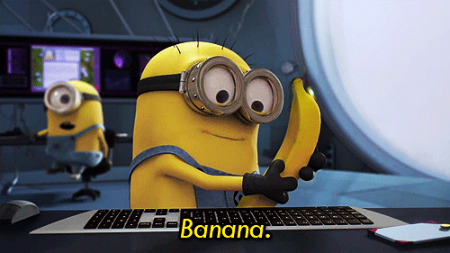
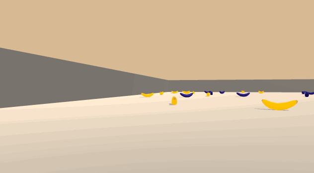
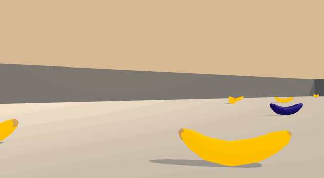

Unity Banana Navigation
==================================



This project aims to solve unity banana navigation environment (see `Environment Details`) using Deep Reinforcement Learning. 

## Environment Details

An agent should learn to navigate (and collect bananas!) in a large, square world. A reward of +1 is provided for collecting a yellow banana, and a reward of -1 is provided for collecting a blue banana. Thus, the goal of the agent is to collect as many yellow bananas as possible while avoiding blue bananas.

The state space has 37 dimensions and contains the agent's velocity, along with ray-based perception of objects around agent's forward direction. Given this information, the agent has to learn how to best select actions. Four discrete actions are available, corresponding to:

0 - move forward.
1 - move backward.
2 - turn left.
3 - turn right.

The task is episodic, and in order to solve the environment, the agent must get an average score of +13 over 100 consecutive episodes.


## Requirements

- Python 3.5 or higher ([Anaconda](https://www.anaconda.com/download/#macos))
- [NumPy](http://www.numpy.org/)
- [PyTorch](https://pytorch.org/) 
- [UnityAgents](https://github.com/Unity-Technologies/ml-agents)
- [OpenAI Gym](https://gym.openai.com/)
- [The Banana Collector Environment](https://github.com/ucaiado/banana-rl/blob/master/drlnd/README.md)

## Run

Run the following command on the terminal; doing so will pop up a window on your default browser which you can then use to explore the `Solution.ipynb` file to learn how to train the agent and run the code.

```shell
$ jupyter notebook
```

## Untrained Agent


## Trained Agent



## References
- Mnih, V., Kavukcuoglu, K., Silver, D., Rusu, A. A., Veness, J., Bellemare, M. G., et al. Human-level control through deep reinforcement learning. Nature, 52015.
- Richard S. Sutton and Andrew G. Barto. Reinforcement Learning: An Introduction.

## License

MIT License

Copyright (c) 2018 Uirá Caiado

Permission is hereby granted, free of charge, to any person obtaining a copy
of this software and associated documentation files (the "Software"), to deal
in the Software without restriction, including without limitation the rights
to use, copy, modify, merge, publish, distribute, sublicense, and/or sell
copies of the Software, and to permit persons to whom the Software is
furnished to do so, subject to the following conditions:

The above copyright notice and this permission notice shall be included in all
copies or substantial portions of the Software.

THE SOFTWARE IS PROVIDED "AS IS", WITHOUT WARRANTY OF ANY KIND, EXPRESS OR
IMPLIED, INCLUDING BUT NOT LIMITED TO THE WARRANTIES OF MERCHANTABILITY,
FITNESS FOR A PARTICULAR PURPOSE AND NONINFRINGEMENT. IN NO EVENT SHALL THE
AUTHORS OR COPYRIGHT HOLDERS BE LIABLE FOR ANY CLAIM, DAMAGES OR OTHER
LIABILITY, WHETHER IN AN ACTION OF CONTRACT, TORT OR OTHERWISE, ARISING FROM,
OUT OF OR IN CONNECTION WITH THE SOFTWARE OR THE USE OR OTHER DEALINGS IN THE
SOFTWARE.

