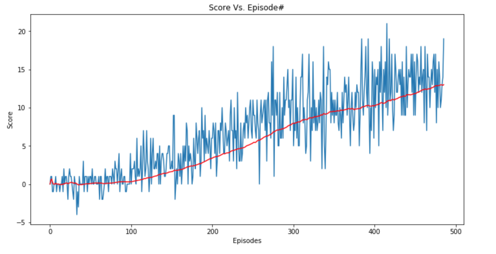

# Project Report

## The Learning Algorithm

The model is inspired from the Deep Q-Network architecture used in the seminal paper entitled - *Human-level control through deep reinforcement learning* (Mnih, V., Kavukcuoglu, K., Silver, D., Rusu, A. A., Veness, J., Bellemare, M. G., et al., Nature, 52015.) However, instead of using raw pixel inputs, the model takes in a 37-dimensional input (state size) from the Unity Banana environment to decide on the next best action (0 - move forward, 1 - move backward, 2 - turn left, 3 - turn right). 

### Model Architecture
The model architecture consists of the following layers:

- Input Layer (input: 37 (state size), output: 128)
- First Fully Connected Hidden Layer (input: 128, output: 64)
- Second Fully Connected Hidden Layer (input: 64, output: 4 (action size))

### Hyperparameters
The following are the choice of the hyperparameters:

- Replay Buffer Size (BUFFER_SIZE): 100000
- Batch Size (BATCH_SIZE): 64
- Discount Rate (GAMMA): 0.99
- Soft Update Rate (TAU): 0.001
- Learning Rate (LR): 0.0005
- Frequency of Update (UPDATE_EVERY): 4
- Max episodes (n_episodes): 5000
- Max steps per episode (max_t): 1000
- Starting Value of the epsilon: 1.0
- Ending Value of the epsilon (eps_end): 0.01
- Epsilon Decay Rate (eps_decay): 0.995


## Plot of Rewards
The environment is considered to be solved if the agent gets an average score of +13 over 100 consecutive episodes. The agent could solve the environment in under 500 episodes. 



```
Episode 100	Average Score: 0.32
Episode 200	Average Score: 3.35
Episode 300	Average Score: 7.95
Episode 400	Average Score: 10.18
Episode 486	Average Score: 13.00
Enviroment Solved in 486 Average Score: 13.00
```

## Future Work
The agent could be improved by exploring the following ideas:

- Raw pixel inputs
- [Double Deep Q Networks](https://arxiv.org/abs/1509.06461)
- [Prioritized Experience Replay](https://arxiv.org/abs/1511.05952)
- [Dueling Deep Q Networks](https://arxiv.org/abs/1511.06581)
- [Multi-step bootstrap targets](https://arxiv.org/abs/1602.01783)
- [Distribution DQN](https://arxiv.org/abs/1707.06887)
- [Noisy DQN](https://arxiv.org/abs/1706.10295)
- [RAINBOW](https://arxiv.org/abs/1710.02298)

